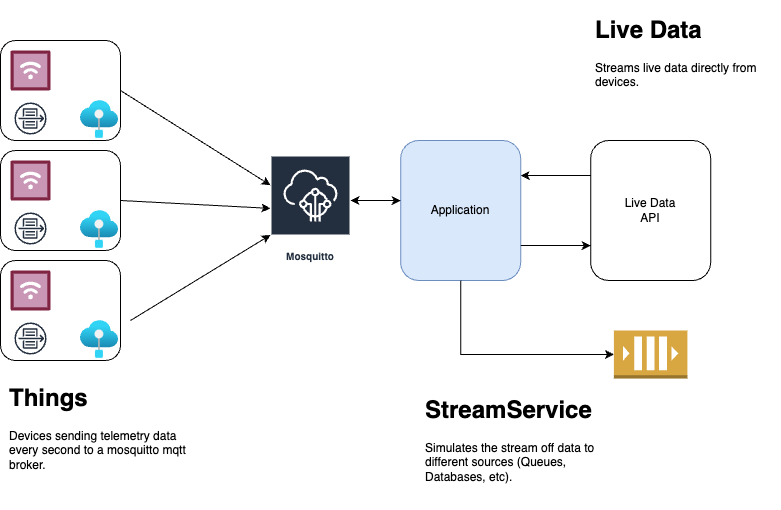

# IOT Sample

---

This GitHub repository serves as a simulation of an IoT environment, where virtual devices generate and transmit telemetry data to an MQTT broker. The application, in response, subscribes to these events, enabling the simulation of streaming data to diverse destinations. Additionally, it offers a REST API that provides real-time access to the telemetry data, allowing users to observe live updates from the devices.



### Dependencies
```
Docker
Docker Compose
```

### How to start the application locally
```
- docker-compose up
```

### Live data API
```
curl localhost:8080/live-data
```

